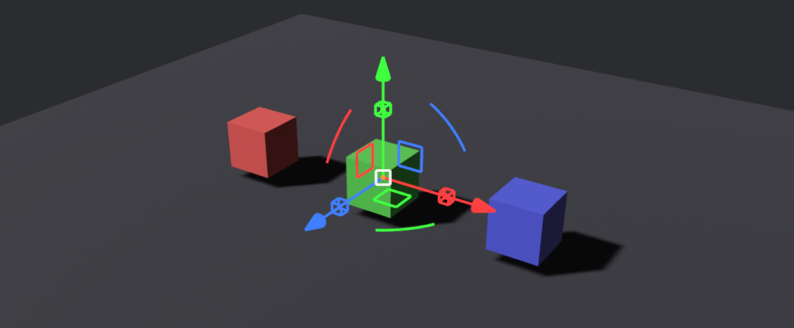

# Bevy Transform Tools
# 
[](https://crates.io/crates/bevy_transform_tools)
[](https://docs.rs/bevy_transform_tools)
[](LICENSE)

A transform gizmo plugin for [Bevy](https://bevyengine.org/) that provides interactive translation, rotation, and scale handles for 3D entities.

## Features

- **Translation** - Move entities along axes (arrows) or planes (rectangles)
- **Rotation** - Rotate entities around any axis (arc handles)
- **Scaling** - Scale entities per-axis (cubes) or uniformly (center square)
- **Coordinate Spaces** - World or local space manipulation
- **Snap-to-Grid** - Optional snapping for translation, rotation, and scale
- **Customizable** - Full control over colors, sizes, and visibility

## Bevy Compatibility

| bevy_transform_tools | Bevy   |
|---------------------|--------|
| 0.1                 | 0.17   |

## Installation

Add to your `Cargo.toml`:

```toml
[dependencies]
bevy_transform_tools = "0.1"
```

## Quick Start

```rust
use bevy::prelude::*;
use bevy_transform_tools::{
    TransformGizmoPlugin, TransformGizmoCamera, TransformGizmoTarget,
    TransformGizmoState,
};

fn main() {
    App::new()
        .add_plugins(DefaultPlugins)
        .add_plugins(TransformGizmoPlugin)
        .add_systems(Startup, setup)
        .run();
}

fn setup(
    mut commands: Commands,
    mut meshes: ResMut<Assets<Mesh>>,
    mut materials: ResMut<Assets<StandardMaterial>>,
    mut gizmo_state: ResMut<TransformGizmoState>,
) {
    // Camera with gizmo support
    commands.spawn((
        Camera3d::default(),
        Transform::from_xyz(0.0, 5.0, 10.0).looking_at(Vec3::ZERO, Vec3::Y),
        TransformGizmoCamera,
    ));

    // Entity that can be manipulated with the gizmo
    let cube = commands.spawn((
        Mesh3d(meshes.add(Cuboid::from_length(1.0))),
        MeshMaterial3d(materials.add(Color::srgb(0.2, 0.7, 1.0))),
        Transform::from_xyz(0.0, 0.5, 0.0),
        TransformGizmoTarget,
    )).id();

    // Set this entity as the active gizmo target
    gizmo_state.active_target = Some(cube);
}
```

## Configuration

### TransformGizmoState

Control the gizmo mode and active target:

```rust
fn switch_mode(mut state: ResMut<TransformGizmoState>) {
    // Switch between modes
    state.mode = TransformGizmoMode::Rotate;

    // Toggle coordinate space
    state.space = TransformGizmoSpace::World;
}
```

### TransformGizmoStyle

Customize appearance at runtime:

```rust
fn customize_style(mut style: ResMut<TransformGizmoStyle>) {
    // Hide rotation handles
    style.show_rotate = false;

    // Adjust axis length
    style.axis_length = 3.0;

    // Change line width
    style.line_width = 2.0;
}
```

### TransformGizmoSnap

Enable snap-to-grid:

```rust
fn enable_snapping(mut snap: ResMut<TransformGizmoSnap>) {
    // Snap translation to 0.5 unit increments
    snap.translate = AxisSnap::uniform(0.5);

    // Snap rotation to 15 degree increments
    snap.rotate = AxisSnap::uniform(15f32.to_radians());
}
```

## Examples

Run the examples with:

```bash
# Basic single-entity manipulation
cargo run --example single_entity

# Switching between multiple gizmo targets
cargo run --example multi_gizmos

# Multi-entity selection with shared pivot
cargo run --example multiple_entities
```

## License

MIT License - see [LICENSE](LICENSE) for details.
